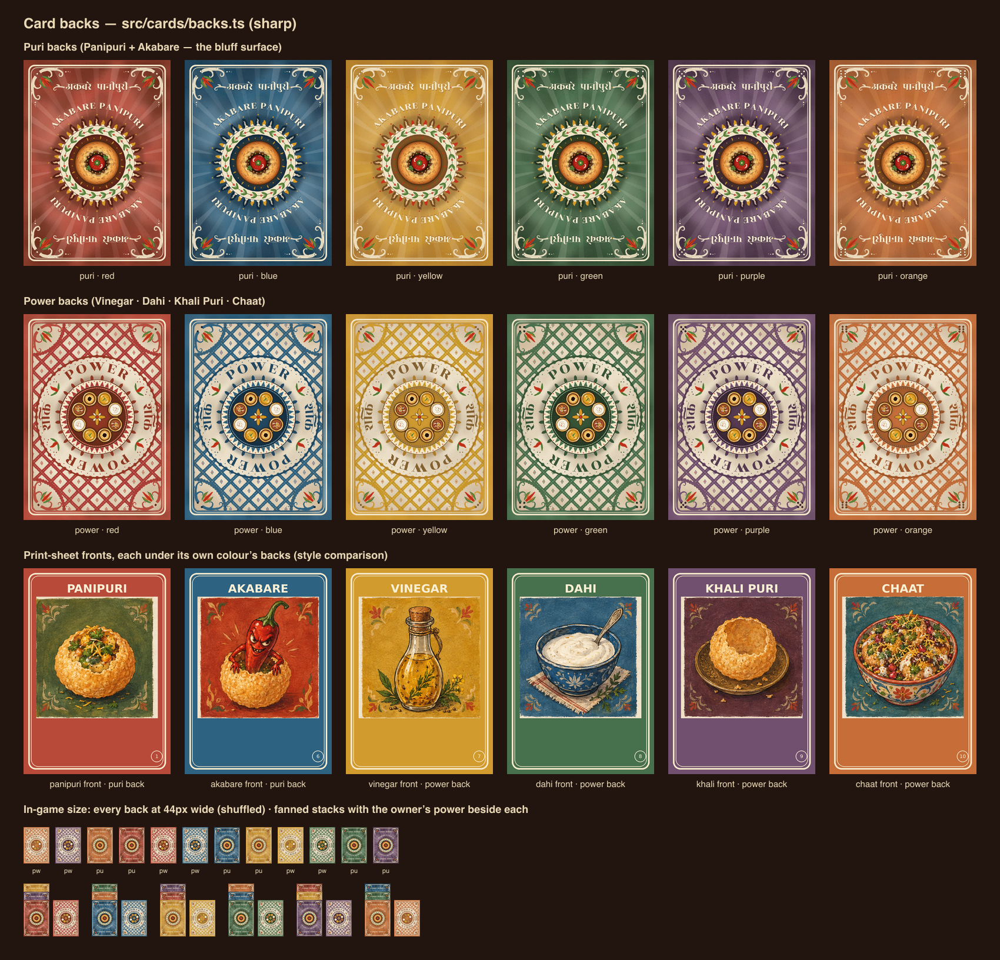

# Card backs: toolkit and constraints

This file covers the toolkit for designing the two card backs. The design brief is in
`docs/ARCHITECTURE.md` under "Card art brief". Record the design itself (motifs and
rationale) in a new section at the end of this file.

## Direction from the user

- The current backs (`source_assets/print_sheets/player*_back.png`) "need a lot of work".
- **"Power cards will have a different colored back as well."** The power back has its
  own colour treatment, not just a different emblem on the same owner-colour field. It
  must still read as the owner's (a player's power sits face down beside their stack).
  The brief suggests inverting the balance: a cream/parchment field with owner-colour
  lattice and medallion. Puri vs power must be obvious at **44px wide**.
- The puri back is identical for Panipuri and Akabare (it's the bluff surface), and the
  owner colour dominates it.

## Building blocks (all in `src/cards/`, framework-free, importable from Node and Vite)

| Module | What it gives you |
|---|---|
| `palette.ts` | `PLAYER_PALETTE[color]` → `{ name, base, deep, darker, light, ink, onBase }`, plus `CREAM #F5E8CA`, `CREAM_BRIGHT #F9EFD3`, `PAPER #EEE1C9`, `INK #3A2418`, `INK_SOFT`, `GOLD #D99A22` (turmeric), `CHILI #C8321A` (akabare), `LEAF`, `PURI_GOLD {light, mid, deep}`, and the OKLCH helpers `hexToOklch`, `oklchToHex`, `mixOklab`, `adjustOklch`, `withAlpha`, `contrastRatio`. Each `base` is the exact frame fill sampled from the print sheets. |
| `geometry.ts` | Measured print-sheet geometry in the 750×1050 space: `FRAME.outer` (8px cream band, r 29) and `FRAME.inner` (3px line, r 31), `ART_BOX` (65,145 620×620), `TITLE`, `RULE_BOX`, `INDEX_CIRCLE`. Reuse the double border so the backs match the fronts. |
| `wordmarks.ts` | HarfBuzz-shaped, outlined Rozha One paths for every string on the cards (`'AKABARE PANIPURI'`, `'अकबरे पानीपुरी'`, `'POWER'`, `'शक्ति'`, the six titles and their Devanagari). `wordmarkSvg(id, { x, y, height, anchor, valign, tracking, maxWidth, fill, stroke, strokeWidth, attrs })` returns one `<path/>`, where `height` is the cap height in output units. `wordmarkMetrics()` is for layout. Tracking spaces Latin letters, and only whole words for Devanagari, so the headline never breaks. |
| `content.ts` | `CARD_INFO`, `BACK_COPY` (`puri: AKABARE PANIPURI / अकबरे पानीपुरी`, `power: POWER / शक्ति`). |

Art: `public/art/{panipuri,akabare,vinegar,dahi,khali,chaat}.webp` (620×620). Fonts in
`assets/fonts/` (OFL): Rozha One, Yatra One, Tiro Devanagari Hindi, Mukta 400–800.

## Scripts

```sh
node scripts/export-backs.mjs --check                                # FINAL export: checks, print/backs/*, public/backs/*.webp
node scripts/check-backs.mjs [module]                                # structure, determinism, 180° symmetry, 44px colour metrics
node scripts/render-backs.mjs src/cards/backs.ts print/backs         # 12 SVG+PNG, contact.png, strip-44.png
node scripts/render-backs.mjs src/cards/backs.ts /tmp/x --colors=red,blue   # quick iteration
node scripts/render-backs.mjs src/cards/backs.ts /tmp/x --renderer=resvg    # cross-check a second renderer
node scripts/build-wordmarks.mjs                                     # regenerate wordmarks.ts + print/wordmark-check.png
node scripts/build-wordmarks.mjs --font=yatra --out=/tmp/wm.ts --png=/tmp/wm.png   # try Yatra One
node scripts/extract-art.mjs [--check]                               # re-extract/verify the art squares
node scripts/render-palette.mjs                                      # print/palette-check.png
```

Look at `contact.png` for the overall design, and at `strip-44.png` at 1:1 for the
phone-size puri/power test. That strip shows the 12 backs shuffled, plus fanned stacks
with each owner's power card beside them.

## Constraints for `src/cards/backs.ts`

- Export `puriBackSvg(color: ColorId): string` and `powerBackSvg(color: ColorId): string`.
  Each returns a standalone `<svg xmlns="http://www.w3.org/2000/svg" viewBox="0 0 750 1050">`.
  The file must use erasable TS only (no enums or namespaces), because Node imports it
  directly.
- Don't use `<text>`. Use `wordmarkSvg()` paths so print PNGs don't depend on installed fonts.
  Don't use external `href`s either: keep everything inline so the SVG works as a data URI.
- The UI may inline several backs in one document. Keep filter, gradient and pattern ids
  unique per colour and kind (for example `pb-red-grain`), or render them via `` or
  CSS `background-image` data URIs. Otherwise the ids collide.
- Painterly texture comes from `feTurbulence`/`feDisplacementMap`/`feColorMatrix`. Check
  both renderers (librsvg is the default, resvg is closer to Chrome). Keep the filter
  region explicit (`x/y/width/height` on `<filter>`) so edges don't clip.
- Heavy filters are slow on phones when many cards are on screen. The UI shows backs at
  about 44–120px wide, so a cheaper variant, or the rendered PNG/WebP, may serve small
  sizes.

---

# Card back design: concept review and final design

The final backs are generated by **`src/cards/backs.ts`** (`BACK_VERSION` 1.0.0), and the app and
print use only that module. The three explored concepts in `src/cards/concepts/` (renders in
`print/concepts/<slug>/`) are kept as a record of the exploration, and nothing imports them.

## Scorecard of the three concepts

Scores are 1–10. Measured numbers come from `node scripts/check-backs.mjs <module>`, which renders
at 375 px. ΔE is the OKLab distance ×100 between the mean colours of two backs at 44 px; about
2 is a just-noticeable difference. "Sym" is the mean channel difference out of 255 between a
back and itself turned 180°, with the noise-only filters removed. Timings are for one
750×1050 card in librsvg on a shared, loaded machine, so treat them as rough.

| Criterion | gouache-medallion | dhaka-weave | mithila-folk |
|---|---|---|---|
| **(a) Style match with the gouache fronts** | **9**. The owner-colour field is a mottled wash, like the fronts' frames. It has a painted, shaded golden puri, and cream corner scrolls with a chili flame bud that echo the fronts' corner sprays. Warm market palette. | **7**. It is convincing Dhaka-topi textile vocabulary (end bands, sawtooth, fringe). But it reads as woven cloth, while the fronts are painted, and the flat bands feel more graphic than gouache. | **5**. Mithila *bharni/kachni* is a different painting tradition: flat fills outlined in ink, hatching, fish and peacocks. It is beautiful folk art, but next to the soft gouache fronts it looks like another deck. |
| **(b) Craft and beauty of the emblem and ornament** | **8**. The most coherent medallion: sunburst, flame-petal lotus, lace band with a leaf-and-berry vine. The side-view puri is well lit. The chili reads a little like a cherry tomato. | **7**. A clean linen patch with a stitched Dhaka ring. The emblem is small for the card, and the bands dominate. | **7**. Very rich (fish ring, sun, peacocks, lotus star), but busy. The puri and chili, which should be the hero, are a small eye inside the sun. |
| **(c) Owner colour legibility across all 6** (ΔE at 44 px, red/orange and yellow/orange, puri · power) | **6**. 5.9 / 8.0 · 3.7 / 4.9. Red and orange power backs are the weakest pair of all three concepts after mithila's. | **7**. 6.4 / 7.2 · 4.4 / 5.2. Per-owner accents (chili on yellow, puri gold on orange) help. | **5**. 4.7 / 5.3 · 3.5 / 3.9. The heavy ink line work greys every colour toward the same brown. |
| **(d) Puri vs power at 44 px** (lightness gain from puri to power; parchment share of the power back) | **8**. +0.08 to +0.15; 20–28 %. A dark disc on colour versus a light card with a dark disc. | **7**. +0.05 to +0.11; 19–31 %. Yellow is the weakest pair of any concept (+0.054). | **9**. +0.11 to +0.14; 27–35 %. The strongest inversion. |
| **(e) Print quality and render robustness** (librsvg, resvg, Chrome) | **8**. Consistent in all three once its resvg displacement-region crash was fixed. | **8**. Consistent in all three. | **7**. resvg and Chrome turn its ink-wobble filter into ragged 1 px edges. |
| **(f) No-cheat** (same puri back for Panipuri and Akabare; a 180° turn reveals nothing) | **4**. The puri back is shared, but the design has an up: the puri is seen from the side, lit from the top left, and the wordmarks read one way. Sym 11–15. A player could turn their own Akabare over to mark it. | **4**. Same problem: an upright emblem and one-way labels. Sym 14–19. | **9**. Built point-symmetric: mirrored wordmarks, twinned petals, seeded blots instead of noise for the wash. Sym 0.18–0.27. |
| **(g) File weight and performance** (SVG size puri / power; librsvg time) | **6**. 58 / 57 KB; 1.4 / 1.9 s. | **7**. 54 / 50 KB; 1.5 / 1.3 s. | **9**. 51 / 37 KB (path minifier); 0.7 / 0.7 s. |
| Raw total (out of 70) | 49 | 47 | **51** |
| Weighted total, (a) and (b) ×2 (out of 90) | **66** | 61 | 63 |

**Winner: gouache-medallion.** On the raw sum mithila-folk is ahead by two points. That lead
comes from (f) and (g), which are engineering properties that can be built into any design,
and the synthesis did exactly that. The user's complaint was that the backs "need a lot of
work", and they have to sit beside hand-painted gouache fronts. So style match and beauty
count double, and on that weighting gouache-medallion wins clearly.

**Grafted from the runners-up**
- *mithila-folk*: strict point symmetry for every element (180° twins via `<use rotate(180)>`,
  even-harmonic wobble, even dash and dot counts). The wordmark is repeated turned at the
  opposite end. The gouache pigment wash is made of seeded blots rather than
  `feTurbulence`, because renderers compute noise in screen space and do not rotate it.
  Relative-coordinate path minification is also taken from here.
- *dhaka-weave*: the four powers shown as katoris of a masala dabba (spice box) rather than
  as symbols in quarters. Per-owner accent choices: chili on yellow, owner-rim on light
  owners. The lattice-as-cloth reading.

## Final design



### Puri back (identical for Panipuri and Akabare)

- **Field.** The owner's sampled frame colour, as a mottled gouache wash in its light and
  shadow shades, with pigment granulation. On top of it are a soft vignette, 32 hand-painted
  sunburst rays and a warm glow behind the medallion.
- **Medallion.**
  - A ring of 20 flame petals (dark owner colour with a pale gold tongue), with short gold
    petals and gold dots between them.
  - A cream lace band carrying a leaf-and-red-berry vine.
  - A deep owner-colour disc with the akabare front's spice-burst heat strokes round the
    puri (period 180°).
- **Emblem.** A golden puri seen from straight above, so it has no up or down.
  - Lit crust relief, fried blisters, hairline cracks and a toasted ring round a broken
    shard crown.
  - A dark hollow with bits of filling (potato, chickpea, pani green) and two coriander
    sprigs.
  - In the hollow sits a glossy **akabare**: a round cherry chili with a wrinkled shoulder
    (dark creases with lit ridges; this is what separates it from a tomato), twin highlights,
    and a toothed green cup calyx with a stem stub pointing at the viewer.
- **Wordmarks.**
  - AKABARE PANIPURI arches over the medallion, and a turned copy arches under it.
  - अकबरे पानीपुरी sits at the top edge between two cream scrolls, with a turned copy at
    the bottom edge.
  - All text is outlined Rozha One paths from `wordmarks.ts`, with a soft owner-shadow
    offset.
- **Frame and corners.**
  - The fronts' exact double cream border.
  - Corner sprays: cream acanthus arms curling back, a chili-red flame bud between two
    leaves, trailing dots.
  - The owner's pips sit in the corner nook.

### Power back ("a different coloured back")

- **Balance inverted.** A deckled parchment panel sits inside an owner-colour margin that
  also has the wash. The panel is woven with an **owner-colour Dhaka lattice**: over/under
  bands with cream running stitches, shadowed crossings, and small diamond cells with a
  chili dot.
- **Halo and corners.** The lattice clears round a halo ringed by owner-colour lace
  scallops. The corners have lace-edged quarter-circle cut-outs that hold the corner spray,
  drawn here in owner colour.
- **Medallion.**
  - Owner-colour outer petals and a cream band with owner sawtooth teeth and chili dots.
  - A deep owner-colour **masala dabba** with a stitched rim.
  - Eight brass katoris hold the four powers twice, on opposite sides: vinegar (golden
    liquid, mustard seeds, dill), dahi (cream swirl, chili specks), chaat (tamarind mix,
    dahi drizzle, sev, pomegranate, coriander) and khali puri (an empty shell).
  - A gold eight-point star at the centre.
- **Legend.** POWER in large owner-dark type on the top of the halo, शक्ति on the right,
  each with a turned twin. Chili-bud-and-leaf separators sit between the words.

### Owner colour: palette usage per owner (palette.ts values untouched)

Only the palette's *usage* varies by owner:

| Owner | Adjustments |
|---|---|
| Red | Rays mix toward a cool pink, the wash shadow is deeper, and the disc leans crimson. The lattice threads mix 42 % toward crimson (#A01E30), away from orange. |
| Orange | Rays mix toward glowing saffron (base → #FFC46E), and the wash is calmer (fewer pale and dark blotches) with a lighter vignette. It stays the vivid orange of its front instead of going brown or milky. |
| Yellow | The wash and vignette shadow is pulled from the sampled khaki toward burnt sienna, so it reads as warm turmeric, not mud. The lattice threads lean mustard (#C4A21C), the accents are chili rather than gold, and the medallion disc is burnt sienna so the golden puri stands out. |
| Light owners (yellow, orange) | A light tin with a dark rim. Dark owners get a dark tin with a bright rim. |

Measured at 44 px (ΔE ×100):

| Pair | Puri back | Power back |
|---|---|---|
| Red / orange | 7.6 | 5.0 |
| Yellow / orange | 7.0 | 5.1 |
| Closest pair overall (blue / purple) | 5.6 | 4.0 |

The red/orange and yellow/orange pairs are better than every concept on both backs.

**Seat pips.** Every corner carries 1–6 die-face pips, the owner's seat number in `COLORS`
order: red 1, blue 2, yellow 3, green 4, purple 5, orange 6. They give owners a mark that
does not depend on colour, for colour-blind players and for print. `ownerPips(color)` is
exported so the UI's owner badge can show the same number. The pips are too small to read at
44 px; there the UI brief's owner-name badge next to face-down cards does the job.

### No-cheat properties (verified by `scripts/check-backs.mjs`)

- There is one puri back per colour. Panipuri and Akabare backs are byte-identical.
- **A 180° turn reveals nothing.**
  - With the noise-only filters removed, each back differs from its turned self by a mean
    of 0.07–0.18 out of 255 (sub-pixel anti-aliasing).
  - The noise-only filters are the 1–2 px paper grain, the ±1.2 px ink wobble and the crust
    relief. Renderers compute noise in screen pixels, so they cannot be rotated, and they
    are far too fine to identify a card's orientation.
  - Two things made this work:
    - Every wash blot is twinned per colour, so overlaps across the centre line composite
      identically.
    - Every dashed ring or stitch has an even count centred on its axis.
- Every call returns the same output (all irregularity is seeded). There are no fonts,
  images or external references.
- Ids are namespaced per kind and colour (`ap-pu-red-*`, `ap-pw-blue-*`). All 396 ids are
  unique across the 12 backs, so any number of backs can be inlined in one document. A
  unit test in `cards.test.ts` checks this.

### Rendering and performance

| | Puri back | Power back |
|---|---|---|
| SVG size | 92 KB | 74 KB |
| librsvg, full card | about 0.9 s | about 1.0 s |

- The ink wobble now runs only over the regions that need it, not the whole card. That cut
  librsvg time from 1.8 s / 3.0 s to the figures above.
- Checked in librsvg (sharp), resvg and Chrome, both inline (12 on one page, 0 duplicate ids,
  0 broken references) and as `` data URIs. Generating and inserting all 12 took about
  40 ms in Chrome.
- **In the app:** never inline the SVG backs. `<Card>` / `<CardBack>` (below) draw the
  pre-rendered `public/backs/{puri,power}-<color>.webp` (375×525) and `…-2x.webp` (750×1050)
  through `srcset`/`sizes`, so a 120 px card on a 3× phone still loads the 1x file. A bitmap
  costs nothing per copy; every inline SVG copy re-runs its filters.
  - Export tuning (compared at 3× zoom): 1x is a lanczos3 750→375 downscale (2× supersampled)
    plus an edge-only unsharp mask (flat areas untouched, so the paper grain is not amplified),
    webp q76 with `smartSubsample` to keep chroma on thin red/green lines. 2x is the print master
    at q76. About 44 KB per 1x file (523 KB for all 12) and 143 KB per 2x file.
  - `src/cards/backImages.ts` is generated with a content hash (`BACK_IMAGE_REV`) that
    `backImageUrl()` appends as `?v=…`, so browsers never show a stale back.

### Files

- `src/cards/backs.ts`. Exports `puriBackSvg`, `powerBackSvg`, `BACK_VERSION`, `backSvg`,
  `backDataUri` and `ownerPips`.
- `print/backs/{puri,power}-<color>.{svg,png}` (750×1050), `print/backs/contact.png` and
  `print/backs/strip-44.png`.
- `public/backs/{puri,power}-<color>.webp` (375×525), `…-2x.webp` (750×1050),
  `public/backs/version.txt`, and the generated `src/cards/backImages.ts`.
- `scripts/export-backs.mjs` (final export; `--check` runs the property checks first,
  `--app-only` skips the print masters) and `scripts/check-backs.mjs` (property checks).

### Known limits

- **Similar colours at 44 px.** Red and orange, and blue and purple, are still the closest
  pairs on the power back (ΔE 4–5). This comes from the sampled palette itself.
  Distinguishable, not identical.
- **Yellow separation.** The yellow puri back and yellow power back have the smallest
  lightness gap of the six (+0.07). They still differ clearly in structure: a coloured field
  with a disc, against a lattice card.
- **SVG size.** The SVGs are larger than the concepts' (74–93 KB). That is fine for print and
  for data-URI ``. Prefer the webps when many backs are on screen.

---

# React card components (`src/cards/Card.tsx`)

The UI draws every card with these; the full prop list is the header comment of
`src/cards/Card.tsx`. Import from `src/cards` (`index.ts`); styles are `src/cards/cards.css`
(plain CSS, every class prefixed `ak-card`). Check them in isolation with `npm run dev` →
`http://localhost:5173/cards-preview.html` (the gallery, `CardGallery.tsx`).

```tsx
<Card back="puri" color="red" />                                     // someone's face-down puri
<Card back="puri" color="red" face="akabare" faceUp={false} peek="akabare" badge="You" />
<Card back="power" color="blue" face="vinegar" width={240} />        // rule text shows from 150 px
<Card back="puri" color="red" face="panipuri" instance={3} state="selectable" onClick={pick} />
<CardStack cards={[{ back: 'puri', color: 'red', badge: 'Y', peek: 'panipuri' }, …]} width={56} />
```

- **Fronts** are HTML/CSS rebuilt from the print sheets (`geometry.ts`): owner-colour field
  with a shared grey gouache wash and paper grain blended `soft-light`
  (`public/art/front-{wash,grain}.webp`, made by `scripts/render-front-texture.mjs`), the
  double cream border and index circle as one scaled inline SVG, the title in Rozha One at
  the printed cap height and baseline, the art square at x 65 / y 145 / 620², and in the lower
  third the Devanagari subtitle between two cream flourishes, a small-caps timing label
  (`CARD_INFO[kind].label`) and the rule (`CARD_INFO[kind].body`). Rule text is the owner's ink
  on yellow and orange (cream fails WCAG there), cream elsewhere.
- **Scaling.** Each face is an inline-size query container and every length is in card units
  (`--u = 100cqw / 750`), so a 56 px card is a faithful miniature of a 360 px one. The rule
  hides below 110 px wide (and by default below 150 px), the Devanagari below 80 px.
- **Flip.** Two faces with `backface-visibility: hidden`, each rotated on its own under the
  root's `perspective` (no `preserve-3d`, which Safari flattens under clipping), plus a small
  lift (`scale` via WAAPI). A front that mounts together with the flip is committed face-down
  first and then turned, so a card revealed to everyone animates too. `prefers-reduced-motion`
  gets a 160 ms cross-fade and no lift.
- **Peek and badge** sit in the top strip of the back, so they stay visible on the lower cards
  of a `<CardStack>` (default offset `max(17, 0.2 × width)` px). Both have pixel minimums
  (13 px chips, 8.5 px text) so they read at 56 px.
- **No leak.** A face-down card of another player must be rendered with `face={null}`: the
  front is in the DOM whenever `face` is set.
